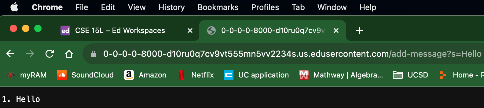
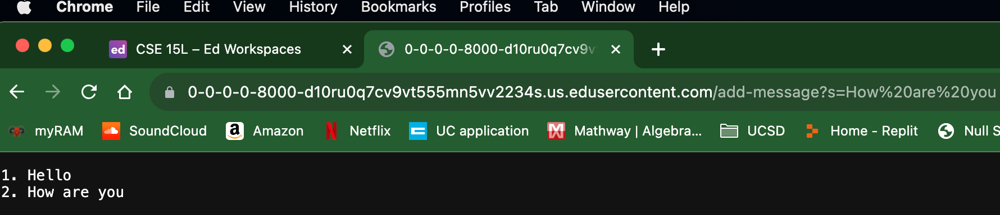

##Part 1

**Code for StringServer:**

```
import java.io.IOException;
import java.net.URI;
import java.io.UnsupportedEncodingException;
import java.net.URLDecoder;


class Handler implements URLHandler {
    int num = 0;
    StringBuilder stringStorage = new StringBuilder();
    public String handleRequest(URI url) {
        if (url.getPath().equals("/add-message")) {
            String query = url.getQuery();
            if (query != null && query.startsWith("s=")) {
                String message = query.substring(2);
                num += 1;
                stringStorage.append(num).append(". ").append(message).append("\n");
                try {
                    String stringChecked = URLDecoder.decode(stringStorage.toString(), "UTF-8");
                    return stringChecked;
                } catch (UnsupportedEncodingException e) {
                    e.printStackTrace();
                }
            }
        } 
        return stringStorage.toString();
    }
}


class StringServer {
    public static void main(String[] args) throws IOException {
        if(args.length == 0){
            System.out.println("Missing port number! Try any number between 1024 to 49151");
            return;
        }
        int port = Integer.parseInt(args[0]);
        Server.start(port, new Handler());
    }
}
```

**Screenshot for `/add-message?s=Hello`:**



- Which methods in your code are called?
  The handleRequest method in Handler class is called.
  
- What are the relevant arguments to those methods, and the values of any relevant fields of the class?
  The relevant arguments to those methods: URI url, UnsupportedEncodingException e.
  The values of any relevant fields of the class: num, stringStorage, query, message, stringChecked.

- How do the values of any relevant fields of the class change from this specific request? If no values got changed, explain why.
  When we request `/add-message?s=Hello`, it would be passed into `handleRequest(URI url)` as the argument of `URI url`.
  - `int num` will increment by 1 everytime `/add-message?s=<string>` is requested: `num` is now 1.
  - `StringBuilder stringStorage` will store a new string everytime `/add-message?s=<string>` is requested: `stringStorage` now has `Hello` as the first stored string.
  - `query` gets value from `url.getQuery()`, which is to recognize the query component of the URL.
  - `message` gets the message string from `/add-message?s=<string>`: `message` is now `Hello`.
  - `stringChecked` after "UTF-8" is decode from `stringStorage`.
  - `UnsupportedEncodingException e` catches unsupported character encoding when using URLDecoder.decode(). The part for `try` and `catch` is to check and return input strings without having '+' for the spaces.
  - If no values got change, which means no additional requests were made by `/add-message?s=<string>`. Then no additional change would be made to the values or pass as arguments, which the output will remain the same as the previous output.

**Screenshot for `/add-message?s=How are you`:**



- Which methods in your code are called?
  The handleRequest method in Handler class is called.
  
- What are the relevant arguments to those methods, and the values of any relevant fields of the class?
  The relevant arguments to those methods: URI url, UnsupportedEncodingException e.
  The values of any relevant fields of the class: num, stringStorage, query, message, stringChecked.

- How do the values of any relevant fields of the class change from this specific request? If no values got changed, explain why.
  When we request `/add-message?s=Hello`, it would be passed into `handleRequest(URI url)` as the argument of `URI url`.
  - `int num` will increment by 1 everytime `/add-message?s=<string>` is requested: `num` is now 2.
  - `StringBuilder stringStorage` will store a new string everytime `/add-message?s=<string>` is requested: `stringStorage` now has `How%20are%20you` as the first stored string.
  - `query` gets value from `url.getQuery()`, which is to recognize the query component of the URL.
  - `message` gets the message string from `/add-message?s=<string>`: `message` is now `How%20are%20you`.
  - `stringChecked` after "UTF-8" is decode from `stringStorage`: `stringChecked` returns `How are you`, so `stringStorage` now returns and outputs as `How are you` without having '+' in between the spaces.
  - `UnsupportedEncodingException e` catches unsupported character encoding when using URLDecoder.decode(). The part for `try` and `catch` is to check and return input strings without having '+' for the spaces.
  - If no values got change, which means no additional requests were made by `/add-message?s=<string>`. Then no additional change would be made to the values or pass as arguments, which the output will remain the same as the previous output.


##Part 2
Using the command line, show with `ls` and take screenshots of:
- The path to the private key for your SSH key for logging into `ieng6` (on your computer or on the home directory of the lab computer)
- The path to the public key for your SSH key for logging into `ieng6` (within your account on `ieng6`)
- A terminal interaction where you log into `ieng6` with your course-specific account without being asked for a password.

##Part 3
- In a couple of sentences, describe something you learned from lab in week 2 or 3 that you didn’t know before:
  I learn how to make webserver and how to easily log into `ieng6`.
